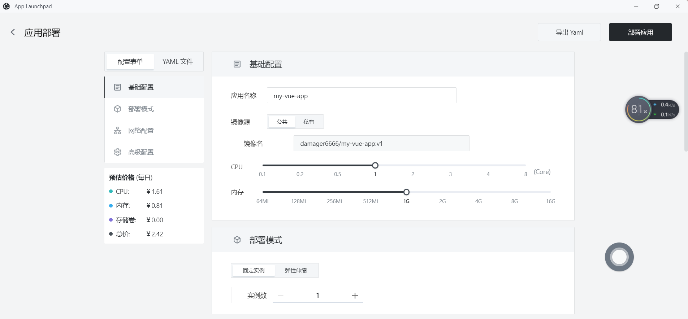
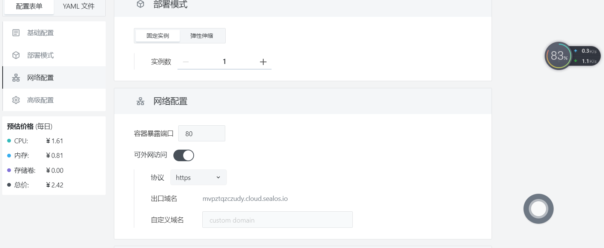
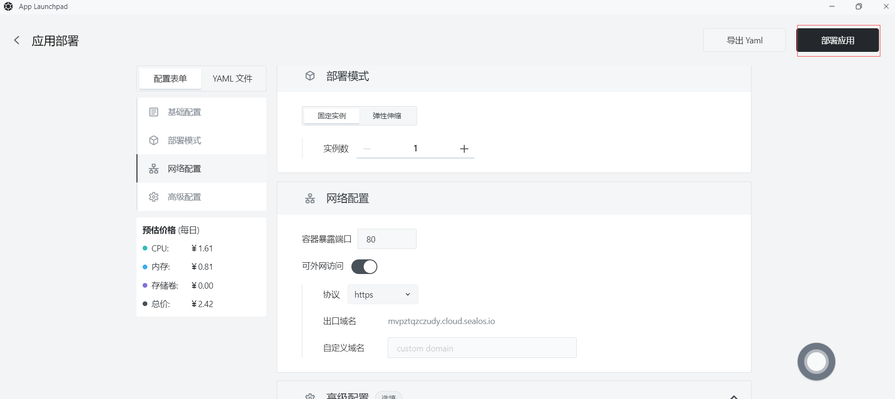
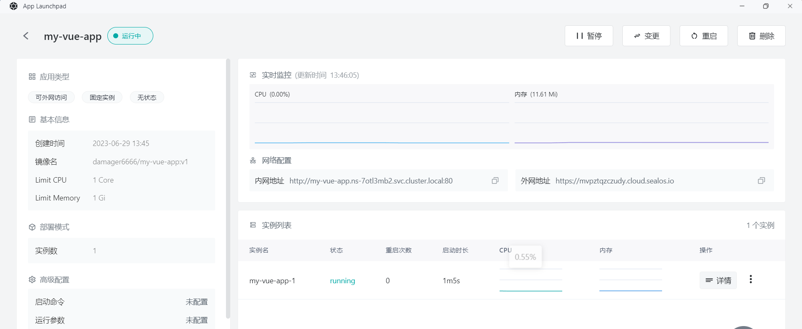
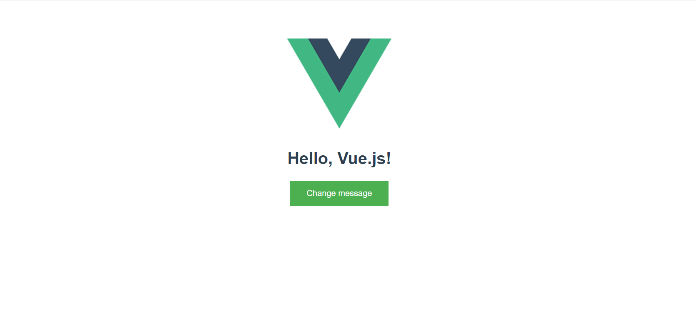

# 快速安装 Vue 程序

首先，确保你已经安装了以下工具：

- Docker
- Node.js
- npm

## 步骤1：安装 Vue CLI

```bash
npm install -g @vue/cli
```

## 步骤2：使用 Vue CLI 创建一个新项目

```bash
vue create my-vue-app
```

## 步骤3：使用 Vue CLI 构建项目的生产版本

```bash
cd my-vue-app
npm run build
```

## 步骤4：创建Docker镜像

- 在与my-vue-app目录中，创建一个名为`Dockerfile`的文件，包含以下内容：

```dockerfile
# 使用 nginx 镜像作为基础镜像
FROM nginx:1.21-alpine

# 复制构建的前端文件到 nginx 容器中
COPY dist/ /usr/share/nginx/html

# 暴露端口
EXPOSE 80

# 启动 nginx
CMD ["nginx", "-g", "daemon off;"]
```

- 在`Dockerfile`所在的目录运行以下命令，为 Vue 应用程序构建 Docker 镜像：

```bash
docker build -t my-vue-app .
```

## 步骤5：推送Docker镜像

将创建的Docker镜像推送到Docker仓库，如Docker Hub或者私有仓库。**假设您已经登录到Docker仓库**，使用以下命令推送镜像

- 首先标记Docker镜像，在推送镜像之前，需要为其添加一个标签，以便 Docker 知道将其推送到哪个仓库。运行以下命令为镜像添加标签：

  ```
  docker tag your-image-name your-dockerhub-username/your-repo-name:your-tag
  ```

  将 `your-image-name` 替换为你的本地镜像名称，`your-dockerhub-username` 替换为你的 Docker Hub 用户名，`your-repo-name` 替换为你在 Docker Hub 上要创建的仓库名称，`your-tag` 替换为你为镜像设置的标签（例如：latest）。

  例如：

  ```
  docker tag my-vue-app damager6666/my-vue-app:v1
  ```

- 接下来推送Docker镜像，使用以下命令将镜像推送到 Docker Hub：

  ```
  docker push your-dockerhub-username/your-repo-name:your-tag
  ```

  将 `your-dockerhub-username`、`your-repo-name` 和 `your-tag` 替换为实际的值。例如：

  ```
  docker push damager6666/my-vue-app:v1
  ```


## 步骤6：登陆 Sealos

- 进入 [Sealos](https://cloud.sealos.io/) 官网


## 步骤7：打开 「应用管理」 应用


## 步骤 8：新建应用

- 在 「应用管理」 中，点击「新建应用」来创建一个新的应用。


## 步骤9：应用部署

- 基础配置：

  - 应用名称（自定义）：my-vue-app
  - 镜像名（**步骤5**中推送的镜像）：damager6666/my-vue-app:v1
  - CPU（推荐）：1 Core
  - 内存（推荐）：1 G

- 部署模式：

  - 实例数（自定义）：1



- 网络配置：

  - 容器暴露端口：80

  - 外网访问：开启



## 步骤10：部署应用

- 点击「部署应用」开始部署应用。



## 步骤11：访问应用

- 点击「应用管理」查看，当应用的 STATUS 由 Pending 变为 Running，则表明该应用已成功启动。
- 当 STATUS 为 Running，即可直接访问外网地址。



- 在浏览器上输入

```
https://mvpztqzczudy.cloud.sealos.io
```



- 页面上显示 ”Hello，Vue.js! “ ，表示你的 Vue 应用程序已经在 Sealos 上运行

